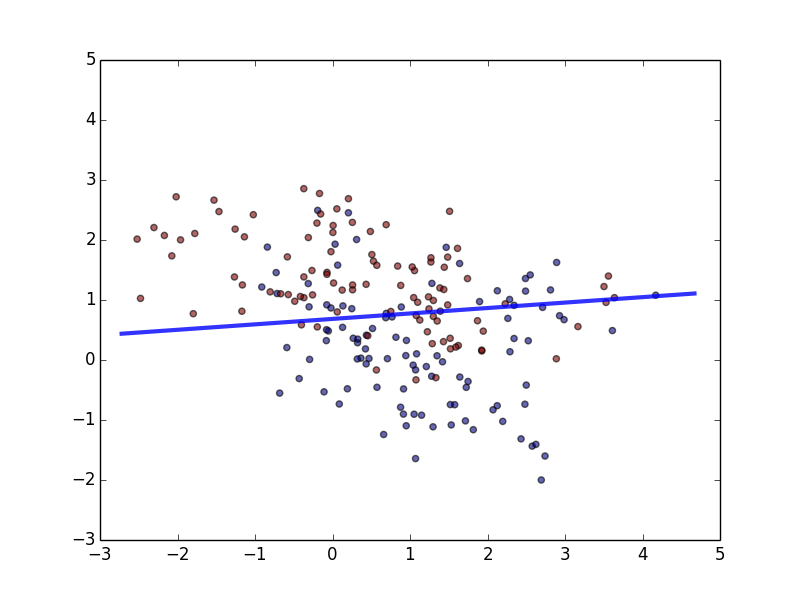
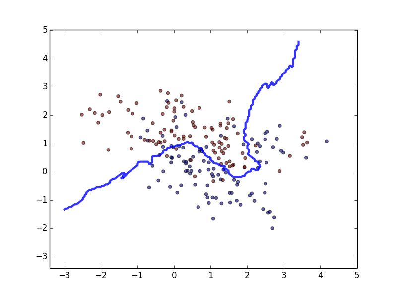
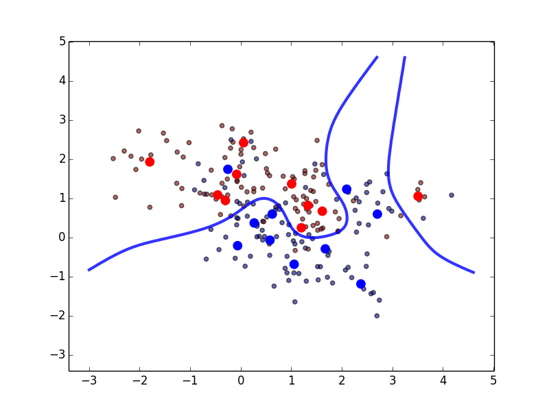

# The-Element-of-Statistical-Learning-Python-Implements
Algorithm Implements with sklearn for book ESL

## Linear Regression

Precision on trainning data: 73.0%

## K Nearest Neighbors

Precision on trainning data: 84.5%

## Optimal Bayes

Precision on trainning data: 85.0%
